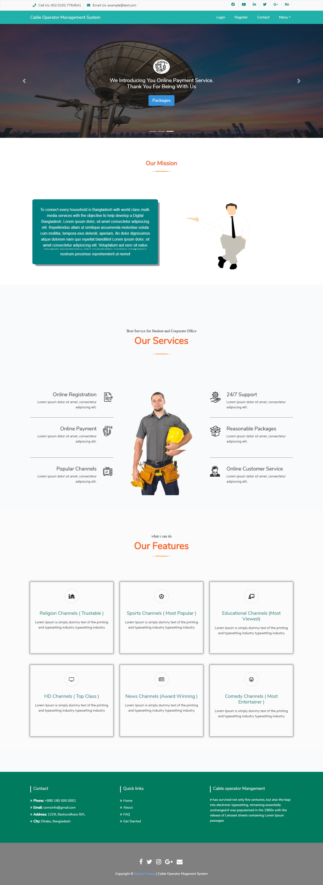

### (1.0) Project Introduction:
  Cable Operator Management System is integrated and automation softwarefor cable operators. Cable operators will distribute TV channels to their customers for that theycharge some money monthly. To maintain their customers and number of users this softwareprovides automation. In this COM System they can main their staff member’s details and theircustomer details. By using this COM System they can divide their areas macro parts to microparts. By using this system they can meet their business requirements. Cable Operators once theydivided their areas into micro parts then they can assign their staff members to take care abouttheir micro part areas. An extensive study of existing system was carried out. There is an existingsystem available in branch. The system is run manually. It is difficult to run efficiently by manpower, and difficult to respond every user within short period. Thus we came to know theessential need to make it automated           
      To automate entire operations of the Cable Operator to maintain their customers list andcollections. In this COM System they can maintain their staff member’s details and theircustomer details. By using this COM System they can divide their areas macro parts to microparts. By using this system they can meet their business requirements. Cable Operators once theydivided their areas into micro parts then they can assign their staff members to take care abouttheir micro part areas.By using this COM System they can know about their equipments located on which areas. Howmany active / non active customers are there? all these details they can about it by using thereports. MIS reports were generated for the month of collections, expenses, pending amount,complaints area wise and date wise, month wise.To maintain entire operations of the  cable operator to be Automated. To maintain entire operations of the cable operator to be automated.The current system is interactive with the database provides efforts can be made sothat the system can adopt the available database features of a new site. 

# (2.1) Browser View:
    

### (2.2) Technology and Languages:

      * MVC framework (Laravel)
      * PHP
      * JavaScript
      * JQuery
      * MySQL Database
      * Xampp Local server
      * Bootstrap 4
      * HTML, CSS

